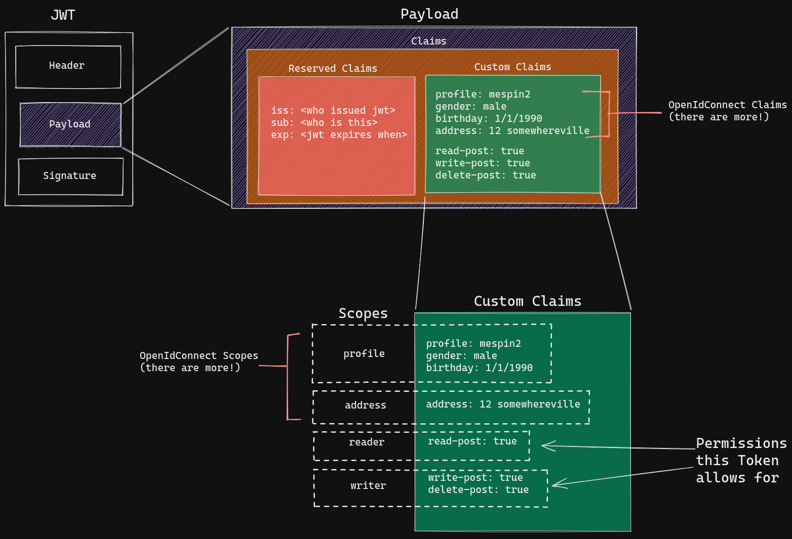
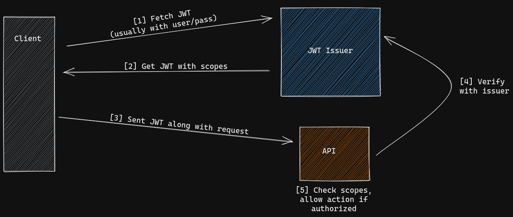

# Istio Authorization Policies

I recently had to debug Istio authorization policies and I learned what a pain it can be understand how and when policies are applied to protect service on your mesh. This post is my attempt to explain the important bits of how to set this up. 

With that said, checkout the [Istio official docs](https://istio.io/latest/docs/reference/config/security/authorization-policy/) for more detail.


## The Tools

### Istio

Istio is one of the leading service mesh implementations out there. It's used by a lot of companies to manage the growing overhead of having services running on Kubernetes. This is especially true when dealing with microservice architectures, which yield dozens (if not hundreds) services which need to talk to each other securely and reliably. 

Using a service mesh, like Istio, handles a lot of this complexity for you. For example app developers do not need implement the following features and can instead use what's configurable in the mesh:
- mTLS between services (encrypted both ways)
- telemetry (common network metrics exposed for Prometheus)
- rate limiting & fault tolerance
- authentication (proving **who** you are)
- authorization (can **you** do **that**?)


There is more the service mesh can do for your, but we're going to focus on the last two in this post. 


## The JWT

(*pronounced 'jot'*)

Authentication is proving who are you. Using Istio, you can request clients calling services on the mesh prove who they are using JWTs ([Javascript Web Token](https://jwt.io/introduction)). This functionality is configured with a [RequestAuthenication](https://istio.io/latest/docs/reference/config/security/request_authentication/) CRD (Custom Resource Definition). Once this functionality is configured you can use [AuthorizationPolicies](https://istio.io/latest/docs/reference/config/security/authorization-policy/) CRDs to enforce RBAC based on provided JWTs.

But to that, you need to understand what the JWT is, and how it's used in conjunction with Istio to enforce RBAC for services.



*Above: Anatomy of a JWT*

The JWT is the standard token used in [OpenIDConnect](https://openid.net/connect/) (OIDC) spec, and widely used as result. It has three pieces to it, the header, **payload**, and signature. We are focused on the payload. Within the JSON payload one can put data (note: keys in the payload are called **claims**). That said, there are certain keys (claims) that are reserved by the JWT spec. Non-reserved claims are called custom claims, of which the OIDC spec [defines a handful of](https://auth0.com/docs/scopes/openid-connect-scopes). These claims are often grouped into scopes. Where a scopes can be thought of as groupings of related permissions. Again, unsurprisingly the OIDC specifies certain scopes.

### Now why does this matter?

Because, having a JWT can act as proof of who you are, and claims within the JWT capture what you are allowed to do. Clients usually obtain a JWT by requesting one from a JWT issuer along with some credentials to prove identity (user/pass/2FA). The JWT is then usually provided by the client to the app in the `Authorization: Bearer <token>` request header. There's a whole slew of tooling around doing this "handshake", from both client and server-side (Istio included). The neat thing about using a service mesh is that Istio can handle this interaction transparently to services. You only need configure the `RequestAuthenication` and `AuthorizationPolicy` objects.



*Above: JWT 'handshake'*


## The RequestAuthentication Object

In the `RequestAuthentication` object you can specify which workloads require a JWT from which trusted issuers. Note you need to provide `jwksUri` so that Istio knows where to grab the certs used in the validation of the tokens (aka the [JSON Web Key Set](https://auth0.com/docs/tokens/json-web-tokens/json-web-key-sets)). Your issuer will have an endpoint for this (sometimes linked from the `well-known` endpoint ).

### Example Request Authentication
In this example, we want our service `httpbin` in the foo `namespace` to require a valid JWT issues from google.
```yaml
apiVersion: security.istio.io/v1beta1
kind: RequestAuthentication
metadata:
  name: foo-req-auth
  namespace: foo
spec:
  selector:
    matchLabels:
      app: httpbin
  jwtRules:
  - issuer: "https://accounts.google.com" # Whose JWTs do you trust?
    jwksUri: "https://www.googleapis.com/oauth2/v3/certs" # Certs to verify JWTs
```


## The AuthorizationPolicy Object

- [x] Understand where principle comes from
- [ ] Create the visualization of many bouncers for thinking about auth policies
- [ ] Include link to auth policy be example doc
- [ ] Is there tooling to check?

Now here it gets a little tricky. There is a lot you can  do with Authorization Policies

TODO Explain a sample auth policy and direct to better docs

```yaml
apiVersion: "security.istio.io/v1beta1"
kind: "AuthorizationPolicy"
metadata:
  name: "allow-reads"
  namespace: foo
spec:
  selector:
    matchLabels:
      app: httpbin
  rules:
  - from:
    - source:
        # principals: ["cluster.local/ns/default/sa/inventory-sa"]
        principals: ["*"]
    to:
    - operation:
        methods: ["GET"]
```


## Access Flow with Auth Policies
There is some simple logic behind how authorization is determined given defined `AuthorizationPolicies`. Below is the flow as taken directly from the Istio documentation.

>1 - If there are any CUSTOM policies that match the request, evaluate and deny the request if the evaluation result is deny.
2 - If there are any DENY policies that match the request, deny the request.
3 - If there are no ALLOW policies for the workload, allow the request.
4 - If any of the ALLOW policies match the request, allow the request.
5 - Deny the request.
[source](https://istio.io/latest/docs/reference/config/security/authorization-policy/)

That said, as a visual learner, I need something tangible to keep this model in my head. So I think of it as someone visiting a cooperate lobby trying to get access to a certain office. 

In this analogy:
- the custom auth policies can be thought of C-level execs
	- They can decided many things, including if your allowed in or not!
- the deny policies can be thought of a office security
	- They are on the look out for features, if you catch their eye they will kick out
- the auth policies can thought of as employees of the office your are visiting
	- They can swipe you into the office if you have reason to be there

Here, you move past first the custom policies, if they know you they will let you in. Or if they know you for bad reasons, they will kick you out.

![[Pasted image 20210716125812.png]]

You've made it past the execs, nice! But here if you catch the eye (match) one of the deny policies, your out!

![[Pasted image 20210716125836.png]]

In this case, on one wants you out. There are not Allow policies defined, so it's assumed you are allowed to enter the office.

![[Pasted image 20210716125851.png]]

But, if any Allow policies are defined, you're going to need to have one of them expecting you (match) to allow you into the office.

![[Pasted image 20210716125918.png]]

If no one is expecting you, but no one kicks you out explcitly. You are not allowed into the office still, 
![[Pasted image 20210716125930.png]]